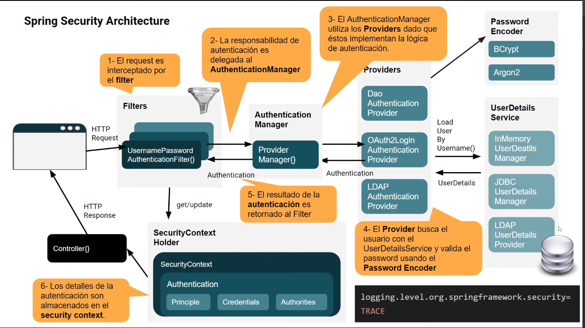

## Spring Rest

Proyecto para entender el flujo de una aplicación web con Spring Rest.

La arquitectura esta explicada en la siguiente imagen:

Imagen tomada de [Spring Security 6](https://www.youtube.com/watch?v=qiPh0yrDNas)

El proyecto esta basado en la explicación de la profesora **Ivana Soledad Rojas Córsico**

El seguimiento del curso se puede hacer apartir de la liga de youtube:
[Spring Security 6](https://www.youtube.com/watch?v=qiPh0yrDNas)

Gracias profesora @irojascorsico

